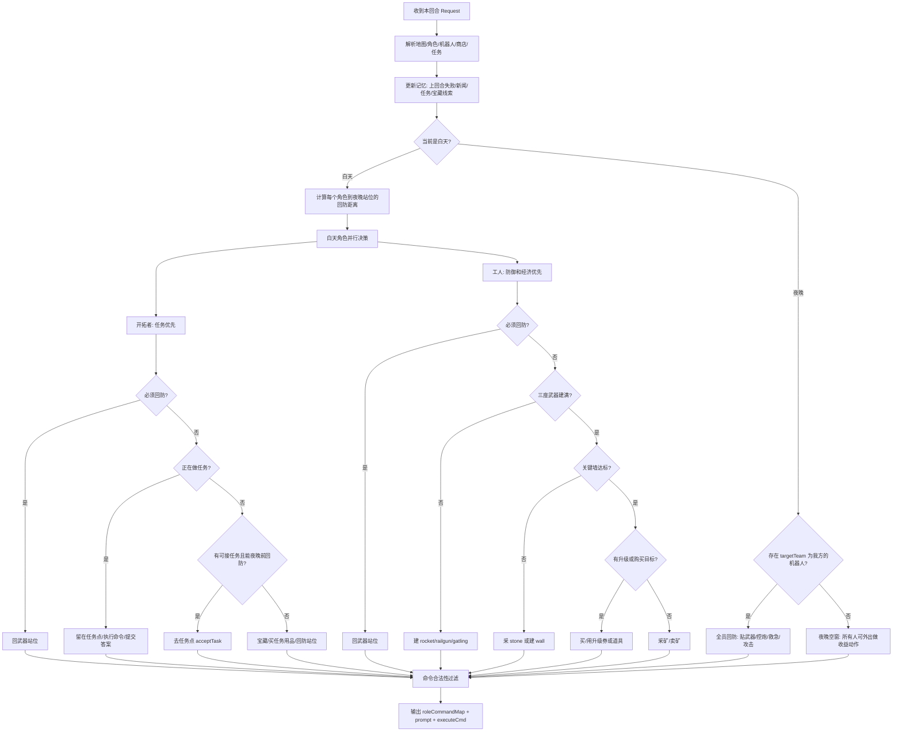
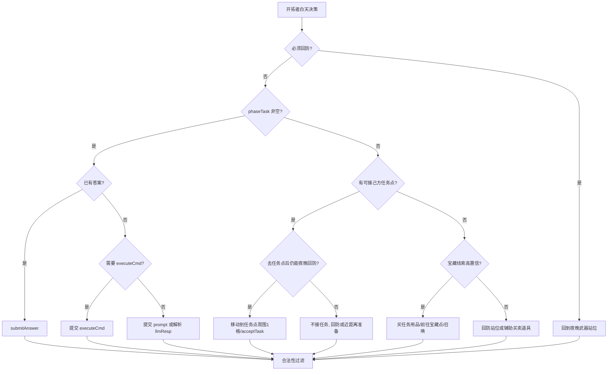
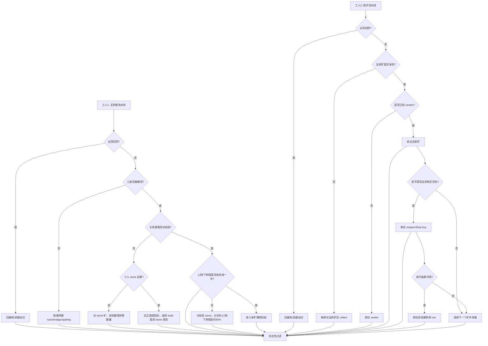
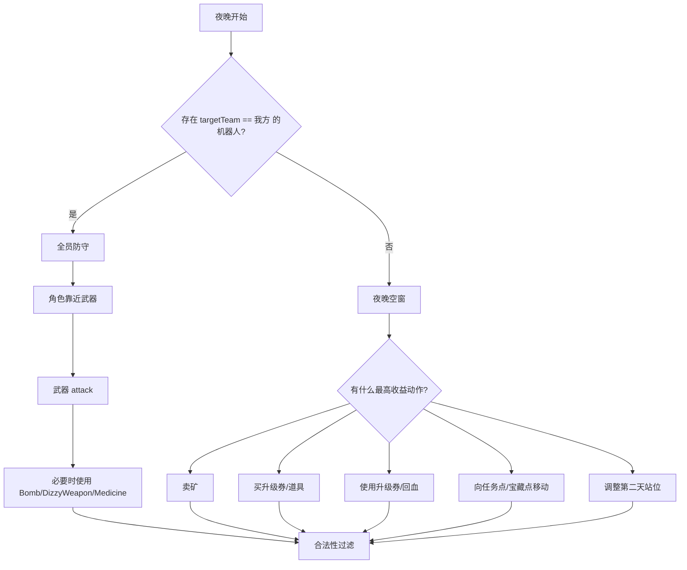
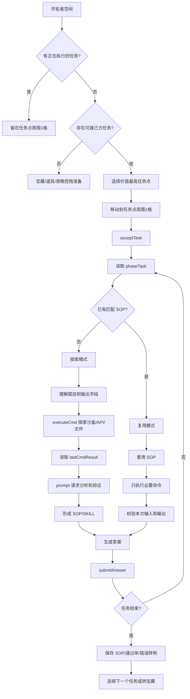

# 《未来战争》状态驱动策略方案

## 1. 核心判断

本策略不按“第几天固定做什么”执行，而是每回合根据当前局面选择动作。核心逻辑是：

```text
白天：工人建设/经济，开拓者优先任务。
夜晚：只要还有攻击我方的机器人，所有人回防控炮。
夜晚：如果没有攻击我方的机器人，则这一波已经结束，所有人都可以出去做安全收益动作。
```

“攻击我方的机器人”优先按接口字段判断：

```text
robot.targetTeam == teamOur.type
```

如果请求里没有 `targetTeam` 字段，则保守处理：夜晚场上机器人默认视为可能威胁我方，直到它们被清空或明显不是朝我方推进。

基地、机器人出生角和主攻面也必须先判断：

```text
我方基地在左上角区域 -> 攻击我方的机器人从右上角出生，但主要从基地右侧压过来
我方基地在右下角区域 -> 攻击我方的机器人从左下角出生，但主要从基地左侧压过来
```

一局同时有两个阵营，机器人也分两拨：一拨 `targetTeam` 是我方，另一拨 `targetTeam` 是对方。防守、攻击和“夜晚是否空窗”只看攻击我方的那一拨；打对方的机器人通常不用管，除非它们挡路或可以顺手蹭击杀收益。

全局优先级：

```text
合法响应 > 夜晚回防 > 工人防御建设 > 开拓者自进化任务 > 升级/道具 > 经济 > 宝藏/进攻
```

这个优先级要按角色拆开，不能把开拓者任务和工人建设互相排队：

```text
开拓者：未完成6个自进化任务时，优先完成任务；完成6个任务后，购买/使用升级券和道具 > 宝藏 > 夜晚控炮
工人1：建武器 > 建主攻面正面墙 > 建上下侧墙各一半 > 采矿卖矿 > 夜晚控炮
工人2：采矿卖矿 > 按队列购买/使用升级券 > 夜晚控炮
全队：只要有攻击我方的机器人，夜晚都回防
```

## 2. 总流程图



关键点：

1. 白天是角色并行，不是所有人都按同一条流水线走。
2. 开拓者白天默认找任务收益，因为它不能建造、拆除、采矿。
3. 工人白天优先补防御和经济，因为这些事情只有工人能做。
4. 夜晚不需要复杂留守等级：有攻击我方机器人就全员防守，没有就全员释放。

## 3. 阵营与进攻方向判断

每回合解析完我方基地后，先确定我方处于哪个角落，再区分“机器人出生角”和“实际主攻面”。墙和武器布局主要看主攻面，而不是只看出生角。

### 3.1 基地角落

基地位置来自 `teamOur.roles` 中的 `station`，基地是 2 x 2，接口给的是左上角坐标。

可以用基地中心粗略判断阵营位置：

```text
station_center_x = station.pos.x + 0.5
station_center_y = station.pos.y - 0.5

如果 station_center_x < map.width / 2 且 station_center_y > map.height / 2：
    我方基地在左上角
否则如果 station_center_x > map.width / 2 且 station_center_y < map.height / 2：
    我方基地在右下角
```

对应出生角与主攻面：

```text
左上基地：
    机器人出生角 = 右上角
    主要推进方向 = 从右向左压向基地
    主攻面 = 基地右侧

右下基地：
    机器人出生角 = 左下角
    主要推进方向 = 从左向右压向基地
    主攻面 = 基地左侧
```

### 3.2 机器人归属

夜晚机器人全图可见，但不是所有机器人都打我方。筛选顺序：

```text
our_robots = [r for r in robots if r.targetTeam == teamOur.type]
enemy_robots = [r for r in robots if r.targetTeam != teamOur.type]
```

如果 `targetTeam` 缺失：

1. 优先按机器人位置、出生角和主攻面推断。
2. 左上基地时，从右上出生并进入基地右侧主攻面的机器人视为我方威胁。
3. 右下基地时，从左下出生并进入基地左侧主攻面的机器人视为我方威胁。
4. 不能确定时保守当作我方威胁。

### 3.3 主攻面对布局的影响

武器、围墙和角色站位都应朝向主攻面倾斜：

```text
左上基地：重点防基地右侧；右上角只做少量防绕路缓冲
右下基地：重点防基地左侧；左下角只做少量防绕路缓冲
```

这会影响：

1. rocket/railgun 优先放在能覆盖主攻面的一侧。
2. gatling 放在靠近可能接敌的内侧近防位置。
3. 关键墙优先补在主攻面，不平均围一圈。
4. 上下侧墙只建少量关键点，防止绕路即可。
5. 夜晚角色站位优先保证主攻面武器有人控制。

## 4. 白天流程

白天目标是最大化建设和任务收益，但必须保证夜晚前能回防。

### 4.1 回防判断

每个白天回合单独判断每个角色是否必须回防：

```text
required = distance(role.pos, role_night_stand_pos)
if rounds_to_night <= required + safety_margin:
    role 当前目标中断，开始回防
```

推荐：

```text
safety_margin = 3 到 5
```

这里的 `role_night_stand_pos` 是基地周围对应武器的操控站位。进入回防阈值后，角色不能继续采矿、卖矿、买东西或任务移动，必须连续移动回基地/武器区域；夜晚开始时三个角色都应该已经回到基地防区。

这个判断按角色执行，但最终要求是全员回防。进入回防阈值后，两个工人都必须停止当前流水线，不能因为某一个工人较近，就让另一个工人继续留在远处。

### 4.2 开拓者白天流程图



开拓者原则：

1. 在 6 个自进化任务没有全部完成前，白天有可接任务时，开拓者优先去任务点。
2. 开拓者不能 `build`、`remove`、`collect`，所以不参与建塔、建墙、拆墙、采矿。
3. 开拓者可以 `move`、`attack`、`sell`、`buy`、`use`、`drop`，但这些只能作为任务/宝藏/防守的辅助动作。
4. 自进化任务期间，开拓者必须留在己方任务点周围 1 格，否则任务直接结束并结算。
5. 如果任务已经接取，是否回防要谨慎：离开任务点等于放弃当前任务，只有夜晚防守压力确定更高时才放弃。
6. 6 个任务全部完成后，开拓者转为购买/使用升级券、购买任务用品和道具、推进宝藏，空闲时再站到夜晚武器旁。

### 4.3 工人白天流程图



工人原则：

1. 两个工人职责固定，不根据距离临时换岗。
2. 工人 1 只负责“武器 -> 主攻面正面墙 -> 上下侧墙各一半 -> 自己采矿赚钱”的流水线。
3. 工人 2 从开局就负责赚钱，不等待工人 1 完成建设。
4. 工人 2 采一个矿时，先把这个矿采完，再去 vendor 卖，不频繁换矿。
5. 工人 1 建墙前先采够一批 stone，再连续建墙把这批 stone 用完；先用在主攻面，再用在上下侧。
6. 上侧和下侧不追求全部完成，各自约完成 50% 后，工人 1 转入赚钱。
7. 两个工人都必须在夜晚有我方机器人时回到基地防守。

## 5. 建设策略

### 5.1 武器

推荐建造顺序：

```text
rocket -> railgun -> gatling
```

原因：

1. rocket 初始射程 10，升级后射程 15，level3 全图，战略价值最高。
2. railgun 初始射程 6，有穿透收益，适合打排队机器人。
3. gatling 初始射程 3，适合近防和补刀。

建造规则：

1. 目标点必须在工人周围 1 格。
2. 接口没有直接给可建武器区，因此需要维护候选点和失败记忆。
3. `build` 失败后，把该点标记为不适合当前建筑，换下一个点。
4. 武器周围必须保留角色站位，不要用墙或其他建筑堵死。
5. 武器布局要覆盖攻击我方机器人的主攻面，而不是平均摆放。

按基地位置调整：

```text
左上基地：
    rocket/railgun 优先放基地右侧覆盖位
    gatling 放基地内侧近防位
    保证基地右侧主攻面进入射程

右下基地：
    rocket/railgun 优先放基地左侧覆盖位
    gatling 放基地内侧近防位
    保证基地左侧主攻面进入射程
```

### 5.2 围墙

围墙不是越多越好，重点是关键墙：

```text
机器人正面推进方向的墙
武器外侧保护墙
少量侧翼防绕路墙
出入口附近的控制墙
```

围墙策略：

1. 先达到基础防线，而不是追求全封闭。
2. 至少保留一个白天出入口。
3. 出入口必须被武器覆盖。
4. stone 不够时先采 stone，不要卖空。
5. 优先补机器人正面推进方向的墙，侧翼只建少量点墙。
6. 不要把上、下、左、右都建满；墙太多会浪费 stone 和工人回合，也可能堵住自己人。

按基地位置调整：

```text
左上基地：
    最高优先级：基地右侧正面墙，因为机器人虽然从右上角出现，但主要从正右方向压过来
    次优先级：右上角少量斜向缓冲墙，防止贴角绕进来
    低优先级：上侧墙、下侧墙只建几个关键点即可，不需要建满
    基本不投入：左侧墙，除非敌方角色或特殊情况需要

右下基地：
    最高优先级：基地左侧正面墙，因为机器人从左下角出现后主要从正左方向压过来
    次优先级：左下角少量斜向缓冲墙，防止贴角绕进来
    低优先级：下侧墙、上侧墙只建几个关键点即可，不需要建满
    基本不投入：右侧墙，除非敌方角色或特殊情况需要
```

墙位建设顺序：

```text
正面墙中线 -> 正面墙上下延伸 -> 正面角点
-> 上侧墙完成约50% -> 下侧墙完成约50%
-> 侧翼少量点墙 -> 转入赚钱
```

判断“建设阶段结束”时，不要求整圈完成，使用以下条件：

```text
正面墙基本完成
且正面入口/角点至少有 2-3 个缓冲墙
且上侧墙完成率约50%
且下侧墙完成率约50%
```

stone 保留线：

```text
正面墙未完成：stone 不卖
正面墙完成、上下侧未到50%：stone 只用于补侧墙
三类墙达到目标：工人1可以卖多余 stone
```

## 6. 经济策略

经济工人采用固定流水线，不根据每回合距离重新选择职责：

```text
选择一个矿 -> 把这个矿采完 -> 去 vendor 卖掉 -> 检查购买目标
-> 金币足够就去 weaponShop 买升级券 -> 去目标建筑旁使用
-> 回到下一个矿继续循环
```

### 6.1 工人 1：建设完成后再赚钱

工人 1 的完整流水线：

```text
建三座武器
-> 收集一批 stone
-> 建主攻面正面墙，直到这批 stone 用完
-> 再收集下一批 stone，继续建墙
-> 正面墙达到目标后，加入采矿卖矿循环
```

武器阶段：

1. 工人 1 按 `rocket -> railgun -> gatling` 顺序建造。
2. 每次只处理当前目标，目标不在相邻一格就移动，到了再 build。
3. 不因为工人 2 在赚钱就让工人 1 等待，初始金币足够时连续完成三座武器。

墙阶段：

1. 工人 1 先去 stone 矿。
2. 采到预设批量后停止采集，不继续把背包装满。
3. 去主攻面正面墙，连续建墙，直到这一批 stone 消耗完。
4. 如果正面墙还没达标，重复“采一批 stone -> 建到用完”。
5. 正面墙达标后，再按“上侧一批 -> 下侧一批”的顺序补墙。
6. 上侧、下侧分别达到约 50% 后，不再继续补满，直接进入赚钱阶段。

推荐批量：

```text
stone_batch = 当前主攻面墙缺口数量
```

实际实现时，可以用 3-6 个 stone 作为普通批量；正面墙最后一批按剩余墙位数量采集，上下侧墙则按达到 50% 所需数量采集，避免多采后又绕路卖矿。

### 6.2 工人 2：固定赚钱流水线

工人 2 从开局就进入经济循环，不参与工人 1 的职责切换：

```text
选定当前最值得采的矿
-> 一直 collect，直到矿区采完/矿点消失/背包达到设定上限
-> 前往 vendor
-> 卖出这一轮采集的矿
-> 判断金币是否达到购买目标
-> 如果达到，前往 weaponShop buy
-> 如果买到升级券，去目标建筑旁 use
-> 重新选择下一个矿
```

“采完一个矿再卖”是为了减少往返和状态切换，不在多个矿点之间来回跳转。

矿点选择不是按角色距离动态换职责，而是由经济目标决定：

```text
当前需要 stone：选择 stone 矿
当前需要快速凑钱：选择 vendorShopList 中单位价格最高的矿
官方新闻预告某矿涨价：优先采该矿并延后出售
没有特殊事件：优先 copper，其次 iron
```

如果矿区每回合产出 1 个矿石，则持续 `collect`，直到：

```text
矿点消失
背包达到预设容量
金币目标已满足且需要立即购买
必须回防
```

### 6.3 经济目标与升级

工人 2 每次卖矿后都重新计算购买目标，不是固定采到满背包才买。

购买目标优先级：

```text
1. WeaponUpgradeVoucher1 -> rocket level1 到 level2
2. StationUpgradeVoucher1 -> 基地 level1 到 level2
3. WeaponUpgradeVoucher2 -> rocket level2 到 level3
4. WeaponUpgradeVoucher1 -> railgun level1 到 level2
5. WallUpgradeVoucher1 -> 主攻面正面墙的关键墙
6. StationUpgradeVoucher2 -> 基地 level2 到 level3
7. WeaponUpgradeVoucher2 -> railgun level2 到 level3
8. WallUpgradeVoucher2 -> 已经 level2 的主攻面关键墙
9. WeaponUpgradeVoucher1/2 -> gatling
10. 任务需要的任务用品
11. Bomb / DizzyWeapon / Medicine 等道具
```

穿插规则：

1. 如果正面墙已经建好，但金币暂时不够下一张武器/基地升级券，可以先买 `WallUpgradeVoucher1` 升级主攻面关键墙。
2. 如果主攻面有几个固定受击点，围墙升级券优先用在这些点，不平均升级所有墙。
3. 如果已经买到 `WeaponUpgradeVoucher1/2`，优先按队列用于 rocket、railgun，再考虑 gatling。
4. 如果开拓者已完成 6 个自进化任务，开拓者也可以去 weaponShop 买券或携带券到建筑旁使用，分担工人 2 的路程。

购买判断：

```text
gold >= target_price
weaponShop 可见目标商品
目标建筑存在且等级匹配
有角色能在后续安全到达目标建筑旁
```

买到升级券后：

```text
buy -> 背包出现升级券 -> 移动到目标建筑周围1格 -> use
```

工人 2 负责经济，但使用升级券时不要求必须由固定工人完成；只要工人 2 能安全到达目标建筑周围一格，就由工人 2 完成。工人 1 正在建墙时，不要为了使用升级券打断工人 1。

开拓者辅助购买条件：

```text
6个自进化任务已完成
或当前没有可接任务且宝藏线索不足
且前往商店/建筑不会影响夜晚回防
```

满足时，开拓者可执行：

```text
buy 升级券/任务用品/Medicine
use 升级券或 Medicine
```

### 6.4 卖矿细节

1. `vendorShopList` 每回合读取当前价格。
2. 工人 2 一轮采集的矿，优先一次性卖出。
3. 不卖工人 1 为正面墙保留的 stone。
4. 工人 1 进入赚钱阶段后，可以与工人 2 使用同一套“采完一矿再卖”的循环。
5. 去 vendor 或 weaponShop 前，如果距离下一次夜晚不足以安全回防，立即结束交易目标，开始回防。

## 7. 夜晚流程

夜晚只看一个最高层判断：

```text
是否存在 targetTeam == teamOur.type 的机器人？
```

如果存在，所有人回防，不做任务、不跑商、不远行。

如果不存在，说明攻击我方这一波已经没有了。另一拨机器人可能还在场上，但它们是打对方基地的，不应占用我方全员防守资源。由于机器人夜晚只在第一个回合统一出现，一波清完后不会再刷出新的自然机器人，因此所有人可以利用夜晚剩余回合外出做收益动作。

### 7.1 夜晚流程图



### 7.2 有我方目标机器人：全员防守

防守动作优先级：

```text
救急道具 > 操控 rocket > 操控 railgun > 操控 gatling > 贴近武器站位
```

全员防守含义：

1. 三个角色都应回到武器附近。
2. 如果已经在武器周围 1 格，则优先作为 controllerId。
3. 如果还没到位，则移动到最近可控武器旁。
4. 如果有 Bomb/DizzyWeapon 且机器人威胁高，可以牺牲该角色本回合控炮来使用道具。
5. 不允许有人跑去接任务、采矿、买卖、远行。
6. 攻击目标只从 `targetTeam == teamOur.type` 的机器人里选；另一拨打敌方的机器人默认忽略。
7. 快到夜晚时，两个工人必须先回到基地/武器区域，不能为了完成当前矿点继续留在远处。

武器目标：

1. rocket：打 3x3 总威胁最高的位置。
2. railgun：打穿透收益最高的方向。
3. gatling：稳定版只打一目标，避免多目标 90 度规则非法；增强版再做多目标。
4. 同等威胁下，优先打位于我方主攻通道上的机器人。

### 7.3 没有我方目标机器人：夜晚空窗

允许所有角色离开防区，因为自然机器人只有一波，已经没有攻击我方目标后，夜晚剩余回合是可利用资源。场上如果还有 `targetTeam` 为敌方的机器人，可以忽略；除非它们阻挡路径，或者我方武器顺手能打且不会影响行动。

夜晚空窗优先级：

```text
工人1：
    如果白天墙还没建完，夜晚只做移动/collect，等白天继续 build
    如果墙已建完，进入自己的采矿卖矿流程
工人2：
    继续当前矿点采集，直到矿点采完
    采完后去 vendor 卖矿
    金币足够就去 weaponShop 买升级券并使用
开拓者：
    继续自进化任务、准备宝藏或移动到下一天目标点
```

仍需注意：

1. 不要发白天限定动作，例如夜晚不能 build。
2. 夜晚可以继续 `collect`、`sell`、`buy`、`use`、`move`、`drop`；只有 `build` 不能执行。
3. 如果工人 2 已经在采矿，不要因为进入夜晚就切换目标；清空我方机器人后继续采当前矿。
4. 如果场上机器人没有 `targetTeam` 字段，不能轻易判断空窗，需结合基地角落、出生角和主攻面推断；推断不了就保守防守。
5. 如果敌方可见单位靠近，我方也要避免角色被堵死。

## 8. 自进化任务策略

### 8.1 任务的真实目标

5.3 的目标不是完成一次问答，而是：

```text
第一个任务：探索任务环境，找出稳定解法
后续任务：复用已经形成的 SOP / SKILL，快速得到答案
最终目标：尽可能完成6个自进化任务，拿满任务积分和金币奖励
```

因此开拓者的任务收益由两部分组成：

```text
当前任务的 scoreReward + goldReward
后续同类任务因复用 SOP 获得的速度和正确率提升
```

第一项任务允许花更多回合探索，后续任务不能每次从零开始。

因此开拓者在 6 个任务完成前的优先级非常高：

```text
自进化任务 > 夜晚无我方机器人时的移动准备 > 宝藏 > 购买升级券/道具
```

只有在夜晚存在攻击我方机器人的时候，基地防守才高于任务。

### 8.2 任务书与接口约束

```text
acceptTask：仅开拓者，在己方任务点周围 1 格触发
submitAnswer：仅开拓者
summonTreasure：仅开拓者
build/remove/collect：仅工人，开拓者不能做
sell/buy/use/drop/move/attack：全部角色可做，开拓者也可做
executeCmd：只有执行任务期间可用
```

自进化任务的结束条件：

```text
任务完成
超过 timeoutRounds
开拓者离开己方任务点周围 1 格
开拓者死亡
```

任务结束后：

1. 当前任务消失。
2. 根据答案通过率获得积分和金币。
3. 任务点进入 30 回合刷新冷却。
4. 无论成功还是失败，都保留探索结果和已形成的 SOP。
5. 如果 6 个任务全部完成，开拓者从“任务 Agent”转为“辅助购买/升级/宝藏角色”。

### 8.3 任务选择

接口给出两个己方任务点，不能只看距离最近，还要看任务点当前价值：

```text
task_value =
    scoreReward
    + goldReward * gold_weight
    + reuse_value
    - travel_cost
    - night_risk
```

任务选择规则：

1. `isValid == true` 且 `coldDownRounds == 0` 才是候选。
2. 第一次接任务时，优先选择距离短、`timeoutRounds` 较长的任务点，用来完成首次探索。
3. 已有匹配 SOP 后，优先选择奖励高、距离短、超时宽裕的任务点。
4. 如果两个任务点都可接，选择完成后冷却不会同时阻塞另一任务点的方案。
5. 不因为工人还没建完防御塔就让开拓者闲置；开拓者和工人是并行角色。

### 8.4 四阶段任务流程



### 8.5 探索模式：第一个任务怎么做

第一个同类任务的目标是建立可复用能力，而不是盲目多次提交答案。

步骤：

1. 读取 `phaseTask`，拆出输入、目标、输出字段、限制条件。
2. 判断题目需要哪类沙盒操作：查看文件、运行 Python、解析接口文档、处理 JSON、计算结果等。
3. 用最小命令探索，不直接执行长命令或大输出命令。
4. 读取 `lastCmdResult`，记录成功命令、输入格式、输出格式和异常情况。
5. 用 `prompt` 让 LLM 归纳：
   - 任务通用步骤；
   - 哪些字段需要替换；
   - 哪些结果需要校验；
   - 最终答案的精确格式。
6. 将归纳结果保存为内部 SOP，不把某一次任务的城市名、数字或答案硬编码成通用规则。
7. 至少完成一次结果校验后，再 `submitAnswer`。

SOP 记录建议：

```text
task_family
input_schema
required_commands
output_schema
answer_template
validation_rules
known_errors
```

### 8.6 复用模式：后续任务怎么做

后续任务的重点是速度和稳定性：

1. 根据 `phaseTask` 识别任务类型。
2. 查找匹配的 SOP。
3. 只替换本次任务的输入参数。
4. 执行 SOP 中必要的命令，不重复无意义探索。
5. 用一条短命令或本地脚本校验结果。
6. 生成符合题目要求的 `taskAnswer`。
7. 提交后读取 `errors` 和 `llmResp`，记录本次成功/失败字段，更新 SOP。

### 8.6.1 增量提交

不要把 `submitAnswer` 只当作最后一步。任务书规定，任务超时后会按此前提交过的最高通过率答案结算，因此应采用增量提交：

```text
第一次：提交已经确认的字段
第二次：补充探索得到的新字段
第三次：根据错误信息修正格式或遗漏字段
最后：提交完整答案
```

增量提交规则：

1. 只提交已经验证过的字段，不用猜测填满未知字段。
2. 收到 `errorCode=2` 后，解析 `description`，定位错误字段或不完整部分。
3. 保存历史答案及其通过率，不能用低通过率答案覆盖高通过率答案。
4. 如果当前答案已经达到较高通过率，后续探索必须保证不会破坏已有正确字段。
5. 距离 `timeoutRounds` 较近时，优先提交当前最佳答案，不再进行高风险探索。

任务得分相关策略：

```text
能完整完成：尽快完成，获得任务奖励及速度加分
只能部分完成：尽量多次提交并提升最高通过率
即将超时：提交历史最佳答案，避免最后一次错误答案成为唯一答案
```

如果后续任务与已有 SOP 只有输入不同，不应再次消耗大量 LLM 探索时间。LLM 应主要用于：

```text
首次任务归纳 SOP
SOP 与新任务不完全匹配
命令结果异常
答案字段不明确
```

### 8.7 prompt 与 executeCmd 的配合

任务期间可以使用 LLM，且不计入每个游戏日的普通 3 次限制。建议一轮只承担一种职责：

```text
executeCmd：获取事实和原始结果
prompt：理解任务、分析结果、生成 SOP 或答案
submitAnswer：提交最终答案
```

不要让 LLM 猜测沙盒中没有验证过的数据。推荐 prompt 包含：

```text
原始 phaseTask
本次 executeCmd 命令
lastCmdResult
已有 SOP
要求的最终输出格式
```

executeCmd 约束：

1. 每次命令尽量短。
2. 输出超过 64KB 前主动缩小范围。
3. 出现 `[TIMEOUT]` 时拆分命令。
4. 出现 `[TRUNCATED]` 时不要直接拿截断结果作答。
5. 沙盒不能访问外网，不能把任务完成建立在网络请求上。

### 8.8 任务与夜晚防守的冲突

任务点任务有一个特殊代价：开拓者离开任务点周围 1 格，任务立即结束。

因此接任务前要判断：

```text
预计完成回合 = 移动回合 + 探索/复用回合 + 提交回合
```

如果预计完成回合明显超过下一个夜晚，接任务仍然可能值得，但必须明确这是一个“可能因夜晚回防而中断”的任务。

处理规则：

1. 白天接任务后，开拓者留在任务点推进。
2. 夜晚出现攻击我方的机器人时，全员回防，开拓者若离开任务点则任务结束。
3. 如果当前答案已经准备好，先 `submitAnswer`，再决定是否回防。
4. 如果任务刚开始且夜晚来临，比较“放弃本次任务的损失”和“基地被攻击的风险”；基地生存优先。
5. 任务结束后保留已探索 SOP，下一次任务不重新从零开始。

### 8.9 任务完成后的复盘

每个任务结束后记录：

```text
是否成功
通过率
历史最高通过率
耗费回合数
使用过的命令
LLM 是否纠正过错误
失败字段和错误信息
```

用这些记录更新：

```text
SOP 版本
任务类型识别规则
答案校验规则
预计完成回合
```

这样自进化的效果才会真正体现出来：第一次任务探索，第二次开始复用，后续任务越来越快、越来越少出错。

### 8.10 六个任务完成后的开拓者转职

当两个任务点的自进化任务总数都完成后，开拓者不再等待任务刷新，转为辅助角色：

```text
第一优先级：购买和使用升级券
第二优先级：购买任务用品并推进宝藏
第三优先级：购买 Medicine/Bomb/DizzyWeapon 等道具
第四优先级：夜晚控炮
```

转职后的开拓者可以分担工人 2 的商店压力：

1. 如果开拓者离 weaponShop 更近，就由开拓者 buy。
2. 如果开拓者离目标建筑更近，就由开拓者 use 升级券。
3. 如果需要任务用品，开拓者自己买并携带，减少背包转移问题。
4. 夜晚有我方机器人时，仍然立即回防控炮。

## 9. 宝藏策略

宝藏依赖 `worldNews.folkLegends` 长上下文推理，不应盲试。

执行条件：

```text
已推断地点
已推断开启时间
已推断完整祭品 item
开拓者背包有祭品
开拓者能到目标点周围 1 格
不会影响夜晚有机器人时的回防
```

注意：`summonTreasure` 只要动作合法，不论是否开启宝藏，都会消耗祭品。因此低置信度不要试。

结果处理：

```text
1 成功：停止宝藏流程
2 无宝藏或未开启：修正地点/时间
3 祭品错误：修正 item
4 宝藏已空：永久停止
0 未探测或非法：检查距离、背包、字段
```

## 10. 失败记忆

必须利用 `lastRoundRoleActionResults`，防止连续犯同一类错误。

记录：

```text
非法建造点
失败移动目标
失败采矿点
失败购买/使用动作
失败攻击组合
```

处理：

1. build 失败：换候选建造点。
2. move 失败：重算路径，避免目标格。
3. collect 失败：矿点可能不可采或受新闻影响，换矿。
4. buy/sell/use 失败：检查距离、金币、背包、商品名。
5. attack 失败：检查是否夜晚、controllerId 是否相邻、武器 cooldown、targetPos 数量。
6. 同一动作同一目标连续失败 2 次，加入短期黑名单。

## 11. 响应合法性

固定响应结构：

```json
{
  "roleCommandMap": {},
  "prompt": "",
  "executeCmd": ""
}
```

合法性规则：

1. 每个角色每回合最多一个动作。
2. 被用作 `controllerId` 的角色本回合不要再发其他动作。
3. `targetPos` 必须是数组。
4. 坐标必须在地图范围内。
5. `build` 只允许白天由 worker 发出。
6. `collect` 只允许 worker 发出。
7. `attack` 只允许夜晚由武器发出。
8. `acceptTask`、`submitAnswer`、`summonTreasure` 只允许 pioneer 发出。
9. buy/sell/use 需要检查距离、背包、金币和商品名。
10. 不确定合法性时宁可不发动作。

## 12. 实现路线

第一阶段：状态骨架

1. 补全响应顶层 `prompt`、`executeCmd`。
2. 解析 `targetTeam`、我方基地角落、机器人出生角、主攻面、`playerTasks`、`vendorShopList`、`weaponShopList`、`worldNews`。
3. 实现白天开拓者任务优先逻辑。
4. 实现工人建武器、建墙、采矿基础逻辑，并按主攻面布置防线。
5. 实现夜晚“是否存在攻击我方机器人”的二分逻辑。

第二阶段：经济闭环

1. 动态卖矿。
2. 动态购买升级券和救急道具。
3. 使用升级券和 Medicine。
4. stone 保留线。

第三阶段：战斗优化

1. rocket 3x3 落点评分。
2. railgun 穿透评分。
3. gatling 多目标合法性。
4. Bomb/DizzyWeapon 使用条件。

第四阶段：任务和宝藏

1. 自进化任务状态机。
2. executeCmd/lastCmdResult 闭环。
3. prompt/llmResp 闭环。
4. 任务 1 探索并保存 SOP/SKILL。
5. 后续任务复用 SOP，并支持增量提交与历史最佳答案。
6. folkLegends 宝藏推理。

## 13. 策略摘要

白天按固定角色流水线运行：开拓者有任务就优先去接任务；工人 1 先按 `rocket -> railgun -> gatling` 建完三座武器，再分批采 stone、建主攻面正面墙，正面墙达标后加入赚钱循环；工人 2 从开局就采一个矿、采完后去 vendor 卖掉，检查金币是否达到升级券价格，达到就去 weaponShop 购买并到目标建筑旁使用，然后继续下一个矿。开拓者的自进化任务不是一次性问答：第一个任务重点探索沙盒并形成 SOP/SKILL，后续任务复用 SOP，通过多次提交和错误反馈提高最高通过率。防线布局要根据基地角落调整：我方在左上时，机器人从右上出生但主攻面是基地右侧；我方在右下时，机器人从左下出生但主攻面是基地左侧。快到夜晚时，两个工人和开拓者都必须停止当前远程行动并回到基地/武器站位。夜晚不做复杂压力分级：只要还有 `targetTeam` 是我方的机器人，所有人都回防控炮；如果没有攻击我方的机器人，这一波就结束了，剩余打敌方的机器人不用占用我方防守资源，两个工人继续各自的采矿、卖矿、购买和升级流水线，开拓者继续任务或宝藏准备，为下一天节约回合。
