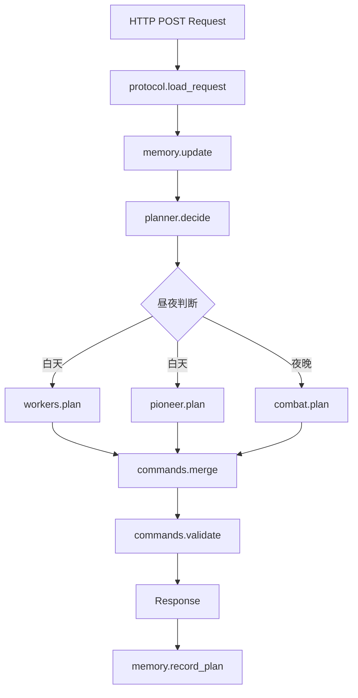
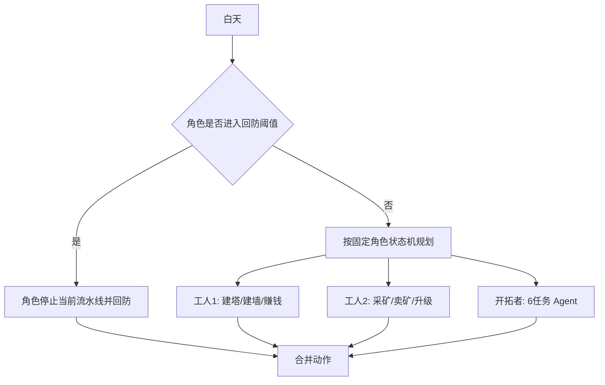
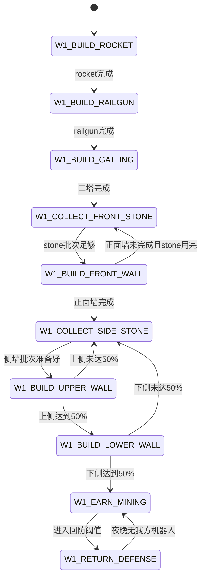
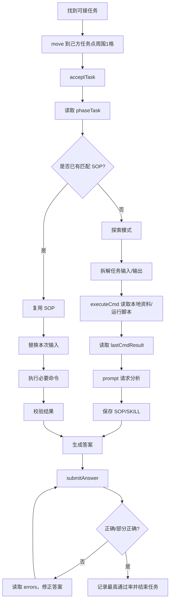

# 《未来战争》Agent 设计文档

## 1. 文档目标

本文档将《未来战争》任务书、接口文档和策略方案转换为可实现的软件设计，作为后续代码开发、联调和测试的依据。

设计重点：

1. 每回合根据状态生成合法动作。
2. 两个工人执行固定职责流水线。
3. 开拓者优先完成 6 个自进化任务，并形成可复用的 Agent SOP/SKILL。
4. 机器人存在时三名角色全部回防；我方机器人清空后恢复原有流水线。
5. 根据我方基地位置确定机器人出生角和主攻面，指导武器与围墙布局。
6. 保存跨回合记忆，避免 HTTP 请求之间丢失任务进度、采矿进度和失败经验。

## 2. 设计原则

### 2.1 状态驱动

程序不按照固定日期或固定回合表运行。每个回合都重新读取当前状态，根据角色自己的流水线状态生成动作。

```text
请求状态 -> 更新记忆 -> 判断昼夜/机器人 -> 角色状态机 -> 命令校验 -> 响应
```

### 2.2 角色职责固定

默认职责不根据距离动态交换：

```text
工人1：建武器 -> 建墙 -> 挖矿赚钱
工人2：挖矿 -> 卖矿 -> 买升级券 -> 使用升级券
开拓者：完成6个自进化任务 -> 购买/升级/宝藏辅助
```

距离只用于寻路和判断是否来得及回防，不用于重新定义角色职责。

### 2.3 防守是全局打断条件

如果存在攻击我方的机器人：

```text
所有角色停止远程任务
所有角色回到基地/武器站位
三名角色共同操控武器
```

如果没有攻击我方的机器人：

```text
机器人波次视为结束
所有角色恢复自己的流水线
```

### 2.4 命令合法性优先

任何收益动作都必须经过合法性检查。无法确定时不发动作，避免累计指令异常。

## 3. 系统架构

### 3.1 目标模块

```text
agent/
├── server.py        HTTP 接口层
├── protocol.py      请求/响应/基础数据结构
├── memory.py        跨回合记忆
├── planner.py       总调度器
├── roles.py         三名角色的状态机
├── workers.py       工人1/工人2流水线
├── pioneer.py       开拓者任务 Agent
├── combat.py        夜晚机器人筛选、武器分配、目标选择
├── economy.py       采矿、卖矿、购买、升级
├── layout.py        基地角落、主攻面、武器/墙目标
├── commands.py      动作构造与合法性校验
└── grid.py          寻路和站位计算
```

### 3.2 当前代码迁移关系

当前 Demo 已有：

```text
server.py   -> HTTP POST 和异常兜底
protocol.py -> Pos、Unit、Robot、Turn、基础命令构造
grid.py     -> next_step 寻路
brain.py    -> 简单白天/夜晚策略
```

后续建议：

1. 保留 `server.py` 的 HTTP 入口。
2. 扩展 `protocol.py`，解析任务、商店、新闻、敌方、错误和 `targetTeam`。
3. 将 `brain.py` 拆成 `planner.py`、`workers.py`、`pioneer.py`、`combat.py`。
4. 新增 `memory.py`，保存跨回合状态。
5. 用 `commands.py` 统一构造和校验全部动作。

### 3.3 总体调用流程



## 4. 数据模型设计

### 4.1 `GameState`

`GameState` 是单回合不可变快照，不能在角色规划过程中随意修改。

```python
@dataclass(frozen=True)
class GameState:
    round_no: int
    day_no: int
    day_round: int
    is_day: bool
    width: int
    height: int
    team_type: str
    gold: int
    roles: tuple[Unit, ...]
    enemy_roles: tuple[Unit, ...]
    robots: tuple[Robot, ...]
    zones: tuple[Zone, ...]
    tasks: tuple[PlayerTask, ...]
    phase_task: str
    world_news: WorldNews
    vendor_prices: Mapping[str, int]
    weapon_shop: Mapping[str, int]
    last_action_results: Mapping[int, bool]
    errors: tuple[GameError, ...]
    last_cmd_result: str
    llm_resp: str
```

### 4.2 单位模型

单位需要保留接口中的以下字段：

```text
id
pos
roleType
health
attackRange
backPackCapability
backpack
level
cooldown
```

基地使用 2 x 2 footprint：

```text
(x, y)
(x + 1, y)
(x, y - 1)
(x + 1, y - 1)
```

### 4.3 `PersistentMemory`

跨回合保存以下内容：

```python
@dataclass
class PersistentMemory:
    team_type: str | None
    base_corner: str | None
    spawn_corner: str | None
    attack_face: str | None
    tower_targets: tuple[Pos, ...]
    front_wall_targets: tuple[Pos, ...]
    upper_wall_targets: tuple[Pos, ...]
    lower_wall_targets: tuple[Pos, ...]
    failed_targets: dict[str, set[Pos]]
    worker1_phase: str
    worker2_phase: str
    worker2_current_mine: Pos | None
    worker2_mine_kind: str | None
    worker2_round_ore_count: int
    pioneer_phase: str
    pioneer_completed_tasks: int
    pioneer_task_point_counts: dict[str, int]
    active_task_started_round: int | None
    active_task_position: Pos | None
    sop_library: dict[str, SOP]
    best_task_answers: dict[str, BestAnswer]
    folk_legend_history: list[str]
    known_treasure: TreasureHypothesis | None
    last_day: int
```

`PersistentMemory` 的存储方式：

1. 单进程运行时保存在内存。
2. 如果判题器可能重启进程，使用本地 JSON 文件持久化。
3. 写文件必须采用临时文件加替换方式，避免半写状态。
4. 记忆文件不保存完整 Request，只保存必要的摘要，控制体积。

## 5. 地图布局设计

### 5.1 基地角落识别

从 `station.pos` 识别基地位置。接口传入的是基地左上角坐标。

```text
左上基地：
    station.x 较小
    station.y 较大

右下基地：
    station.x 较大
    station.y 较小
```

设计上保存：

```text
base_corner = upper_left | lower_right
spawn_corner = upper_right | lower_left
attack_face = right | left
```

### 5.2 主攻面

```text
upper_left base:
    机器人出生角：upper_right
    主攻面：基地 right side

lower_right base:
    机器人出生角：lower_left
    主攻面：基地 left side
```

布局目标：

```text
front_wall_targets  -> 主攻面正面墙，最高优先级
upper_wall_targets   -> 上侧墙，建设约50%
lower_wall_targets   -> 下侧墙，建设约50%
```

不生成完整环形墙目标，避免浪费 stone、堵路和拖慢工人 1 转入赚钱阶段。

### 5.3 武器目标

武器建造顺序固定：

```text
rocket -> railgun -> gatling
```

武器目标需要满足：

1. 位于可尝试建造区域。
2. 能覆盖主攻面。
3. 武器周围保留角色站位。
4. 不堵住基地出入口。

如果某候选点 `build` 失败：

```text
记录 failed_targets["build:<kind>"]
切换到下一个候选点
```

## 6. 总调度器

### 6.1 `planner.decide`

```python
def decide(state: GameState, memory: PersistentMemory) -> Decision:
    memory.update_from_state(state)

    if state.is_day:
        commands = plan_day(state, memory)
    else:
        commands = plan_night(state, memory)

    commands = validate_and_resolve_conflicts(commands, state, memory)
    memory.record_commands(commands)
    return Decision(commands=commands)
```

### 6.2 白天调度

白天同时规划三个角色，但每个角色只生成一条动作。



### 6.3 夜晚调度

```python
def plan_night(state, memory):
    our_robots = combat.targeting_our_team(state)

    if our_robots:
        return combat.plan_full_defense(state, memory, our_robots)

    return plan_night_opportunity(state, memory)
```

如果 `targetTeam` 缺失，按基地出生角、主攻面和机器人移动趋势保守推断；无法确认时按存在我方威胁处理。

## 7. 工人 1 设计：建设流水线

### 7.1 状态定义

```text
W1_BUILD_ROCKET
W1_BUILD_RAILGUN
W1_BUILD_GATLING
W1_COLLECT_FRONT_STONE
W1_BUILD_FRONT_WALL
W1_COLLECT_SIDE_STONE
W1_BUILD_UPPER_WALL
W1_BUILD_LOWER_WALL
W1_EARN_MINING
W1_RETURN_DEFENSE
```

### 7.2 状态转移



### 7.3 建塔规则

1. 工人 1 固定负责三座武器的建造。
2. 每次只追踪一个当前建筑目标。
3. 距离目标大于 1 时 `move`。
4. 距离目标等于 1 时 `build`。
5. 初始金币 75，三座武器各 25，开局优先完成三塔。
6. 工人 2 不因为工人 1 建塔而改变自己的经济职责。

### 7.4 建墙规则

工人 1 先采石，再一次性消耗这一批 stone：

```text
采 stone_batch
-> 去主攻面
-> 连续 build front wall
-> stone 用完
-> 再采下一批
```

建设顺序：

```text
主攻面正面墙：优先完成
上侧墙：完成约50%
下侧墙：完成约50%
```

不考虑墙被打残后的维修状态；当前设计只负责初始防线建设。

### 7.5 赚钱阶段

墙目标达到后，工人 1 复用工人 2 的经济循环：

```text
选择矿 -> 采完一个矿 -> vendor 卖矿 -> 检查是否需要购买
```

## 8. 工人 2 设计：经济流水线

### 8.1 状态定义

```text
W2_SELECT_MINE
W2_MOVE_TO_MINE
W2_COLLECT_MINE
W2_MOVE_TO_VENDOR
W2_SELL_BATCH
W2_CHECK_PURCHASE
W2_MOVE_TO_SHOP
W2_BUY_UPGRADE
W2_MOVE_TO_TARGET
W2_USE_UPGRADE
W2_RETURN_DEFENSE
```

### 8.2 采矿批次

工人 2 不在多个矿点之间频繁切换：

1. 选择当前目标矿。
2. 保存 `worker2_current_mine`。
3. 持续采集该矿。
4. 矿点消失、达到设定批次或必须回防时结束。
5. 有采集批次时去 vendor 一次性卖出。

默认矿物选择：

```text
需要 stone：stone
需要快速赚钱：vendor 当前单价最高的矿
无特殊目标：copper -> iron
新闻预示某矿涨价：优先囤该矿
```

### 8.3 购买和升级队列

购买队列：

```text
1. WeaponUpgradeVoucher1 -> rocket level2
2. StationUpgradeVoucher1 -> station level2
3. WeaponUpgradeVoucher2 -> rocket level3
4. WeaponUpgradeVoucher1 -> railgun level2
5. WallUpgradeVoucher1 -> 主攻面关键墙
6. StationUpgradeVoucher2 -> station level3
7. WeaponUpgradeVoucher2 -> railgun level3
8. WallUpgradeVoucher2 -> 主攻面关键墙
9. WeaponUpgradeVoucher1/2 -> gatling
10. 任务用品和救急道具
```

允许穿插 `WallUpgradeVoucher1/2`：

```text
正面墙基础建设完成
金币暂时不足下一张武器/基地券
主攻面存在关键墙目标
```

满足以上条件时，先升级关键墙，不等于切换工人职责。

### 8.4 购买后使用

```text
buy 商品
-> 确认背包出现商品
-> 移动到目标建筑周围一格
-> use 商品 + targetPos
-> 记录使用结果
```

如果购买失败：

1. 检查金币。
2. 检查背包容量。
3. 检查是否位于 weaponShop 周围一格。
4. 不重复发送同一失败动作。

## 9. 开拓者设计：自进化 Agent

### 9.1 角色目标

开拓者在前 6 个自进化任务完成前，主要目标是拿任务奖励和建立任务能力：

```text
接任务 -> 探索任务环境 -> 形成 SOP/SKILL -> 提交答案
-> 复用 SOP 完成后续任务 -> 尽可能完成全部6个任务
```

6 个任务全部完成后，开拓者转为：

```text
购买/使用升级券
购买任务用品和道具
推进宝藏
夜晚控炮
```

### 9.2 任务状态

```text
P_WAIT
P_MOVE_TO_TASK
P_ACCEPT_TASK
P_EXPLORE_TASK
P_EXECUTE_CMD
P_READ_CMD_RESULT
P_BUILD_SOP
P_GENERATE_ANSWER
P_SUBMIT_ANSWER
P_RETRY_BEST_ANSWER
P_TASK_FINISHED
P_ASSIST_ECONOMY
P_TREASURE
P_RETURN_DEFENSE
```

### 9.3 Agent 任务闭环



### 9.4 探索模式

第一个任务重点不是速度，而是获得后续任务可复用的操作能力：

1. 读取 `phaseTask`。
2. 识别任务类型和输入字段。
3. 确认答案输出格式。
4. 使用短命令探索沙盒。
5. 记录命令、输入、输出和错误。
6. 用 `prompt` 归纳通用 SOP。
7. 用真实结果校验 SOP。
8. 再提交答案。

SOP 数据结构：

```python
@dataclass
class SOP:
    family: str
    input_fields: tuple[str, ...]
    commands: tuple[str, ...]
    output_schema: str
    answer_template: str
    validators: tuple[str, ...]
    version: int
```

### 9.5 复用模式

已有 SOP 时：

1. 根据 `phaseTask` 识别任务族。
2. 加载对应 SOP。
3. 替换本次输入参数。
4. 执行必要命令。
5. 校验输出。
6. 快速生成 `taskAnswer`。
7. 提交并记录错误反馈。

### 9.6 增量提交和最高通过率

任务超时后按此前最高通过率答案结算，因此维护：

```text
best_answer
best_pass_rate
answer_history
```

提交策略：

```text
第一次：提交已经确认的字段
第二次：补充新确认字段
第三次：根据错误信息修正
接近超时：提交历史最佳答案
```

不能让最后一次低质量答案覆盖历史最佳答案。

### 9.7 六个任务完成后的转职

当两个任务点的自进化任务全部完成，且累计完成数达到 6：

1. 开拓者不再等待已完成任务点刷新。
2. 优先检查升级队列。
3. 如果离 weaponShop 近，负责 buy。
4. 如果离目标建筑近，负责 use。
5. 购买任务用品并推进宝藏。
6. 夜晚有我方机器人时，仍然回防控炮。

## 10. 夜晚战斗设计

### 10.1 机器人归属

```python
our_robots = [
    robot for robot in state.robots
    if robot.target_team == state.team_type
]
```

机器人分两拨：

```text
targetTeam == 我方：我方防守目标
targetTeam == 敌方：另一方防守目标，默认忽略
```

### 10.2 有我方机器人

三名角色全部回防：

```text
工人1 -> rocket
工人2 -> railgun/gatling
开拓者 -> 剩余武器
```

角色未到武器旁：

```text
move 到武器周围一格
```

角色已到武器旁：

```text
由武器发 attack，controllerId 填角色 ID
```

目标选择：

1. 只从 `our_robots` 选择。
2. 优先主攻面通道上的机器人。
3. 优先 BOSS、大型、高威胁机器人。
4. rocket 选择 3 x 3 收益最高落点。
5. railgun 选择穿透收益最高方向。
6. gatling 初版只打一目标，避免 90 度多目标非法。

### 10.3 没有我方机器人

不再强制站岗，恢复角色流水线：

```text
工人1：
    墙未完成 -> 继续 collect，为下一白天 build 准备
    墙已完成 -> 继续采矿/卖矿

工人2：
    继续当前矿
    采完后卖矿
    金币够则买券并使用

开拓者：
    继续任务
    任务完成后准备宝藏或辅助升级
```

夜晚仍然禁止 `build`，但允许：

```text
collect
sell
buy
use
drop
move
```

## 11. 回防机制

### 11.1 回防阈值

```text
rounds_to_night = 70 - day_round
required = path_length(role.pos, role_night_stand_pos)

if rounds_to_night <= required + safety_margin:
    role -> RETURN_DEFENSE
```

进入 `RETURN_DEFENSE` 后：

1. 取消当前采矿、卖矿、商店、任务移动。
2. 角色连续向基地/武器区域移动。
3. 三个角色都回防，不设置“只留一个人”的等级。
4. 夜晚开始前必须完成回防。

### 11.2 任务中的开拓者

开拓者离开任务点周围一格会结束任务，因此：

```text
任务未完成 + 夜晚无我方机器人 -> 留在任务点继续任务
任务未完成 + 夜晚有我方机器人 -> 基地生存优先，离开任务点回防
```

离开任务点后要记录任务中断，保留 SOP 和历史最佳答案。

## 12. 命令系统

### 12.1 命令构造

`commands.py` 提供：

```python
move(role_id, target)
attack(weapon_id, controller_id, targets)
build(role_id, name, target)
collect(role_id, mine)
sell(role_id, name, count)
buy(role_id, name, count)
use(role_id, name, target=None)
drop(role_id, name)
accept_task(role_id)
submit_answer(role_id, answer)
summon_treasure(role_id, target, items)
```

### 12.2 校验规则

输出前检查：

1. 每个角色最多一条命令。
2. `controllerId` 角色本回合不能再执行其他动作。
3. `build` 只能白天由工人执行。
4. `collect` 只能由工人执行。
5. `attack` 只能夜晚由武器执行。
6. `acceptTask`、`submitAnswer`、`summonTreasure` 只能由开拓者执行。
7. 相邻动作必须满足切比雪夫距离小于等于 1。
8. `targetPos` 必须是数组。
9. 坐标必须在地图范围内。
10. 失败动作进入记忆，避免下一回合重复发送。

### 12.3 顶层响应

始终返回：

```json
{
  "roleCommandMap": {},
  "prompt": "",
  "executeCmd": ""
}
```

任务期间根据状态填充 `prompt` 或 `executeCmd`，非任务期间保持空字符串。

## 13. 错误处理与记忆

### 13.1 动作结果

读取 `lastRoundRoleActionResults`：

```text
true  -> 保留当前目标
false -> 记录失败原因并切换候选目标
```

### 13.2 错误分类

```text
errorCode=1 -> 任务超时，保存 SOP 和最佳答案
errorCode=2 -> 答案错误，修正字段并重试
errorCode=3 -> 网络错误，调整任务策略或不依赖网络
errorCode=4 -> 指令错误，修复命令格式
errorCode=5 -> 普通 LLM 次数用完；任务期间不受每日限制
```

### 13.3 失败记忆

保存：

```text
失败建造点
失败移动目标
失败采集点
失败商店动作
失败升级券使用
失败攻击目标/目标数组
```

同一动作和目标连续失败两次，加入短期黑名单。

## 14. 测试设计

### 14.1 协议测试

1. 样例 Request 能正常解析。
2. 空字段、缺失字段不会导致服务崩溃。
3. 顶层响应包含三个字段。
4. 角色 ID 使用字符串 key。

### 14.2 工人 1 测试

1. 三座武器按 rocket、railgun、gatling 顺序建设。
2. 正面墙优先于上下侧墙。
3. 上下侧墙分别达到约 50% 后转入赚钱。
4. stone 批次采集后连续用于建墙。
5. 夜晚有我方机器人时中断流水线并回防。
6. 夜晚无我方机器人时恢复流水线。

### 14.3 工人 2 测试

1. 从开局进入采矿状态。
2. 一个矿采完后再前往 vendor。
3. 卖矿后正确判断升级券目标。
4. 买券后能移动到目标建筑旁使用。
5. 购买失败不重复发送。
6. 夜晚清场后继续当前矿点。

### 14.4 开拓者测试

1. 只在己方任务点接任务。
2. 任务期间不离开任务点周围一格。
3. `executeCmd`、`lastCmdResult`、`prompt`、`llmResp` 闭环正常。
4. 首次任务能保存 SOP。
5. 后续任务能复用 SOP。
6. `errorCode=2` 后能增量修正答案。
7. 保存历史最高通过率。
8. 完成 6 个任务后转入购买/升级/宝藏角色。

### 14.5 夜晚测试

1. 只攻击 `targetTeam` 为我方的机器人。
2. 两拨机器人同时存在时不误判清场。
3. 我方机器人清空后所有角色恢复流水线。
4. rocket 冷却时不发送无效攻击。
5. 三名角色都能回到武器站位。

## 15. 实现顺序

### 第一阶段：协议和框架

1. 扩展 `protocol.py` 数据模型。
2. 新增 `memory.py`。
3. 新增 `commands.py`。
4. 将 `server.py` 响应补全为标准顶层结构。

### 第二阶段：固定工人流水线

1. 实现工人 1 三塔建设。
2. 实现工人 1 stone 批次和正面墙/侧墙 50% 目标。
3. 实现工人 2 采矿、卖矿、购买、使用升级券。
4. 实现夜晚清场后的流水线恢复。

### 第三阶段：开拓者 Agent

1. 实现任务点选择。
2. 实现任务状态机。
3. 实现 `executeCmd` 和 `prompt` 协作。
4. 实现 SOP 保存和复用。
5. 实现增量提交和最高通过率。
6. 实现 6 任务完成后的转职。

### 第四阶段：夜晚战斗

1. 实现 `targetTeam` 筛选。
2. 实现基地出生角和主攻面。
3. 实现三角色控炮分配。
4. 实现 rocket/railgun/gatling 目标策略。

### 第五阶段：测试和稳健性

1. 补齐协议、状态机和命令校验测试。
2. 用样例 Request 回放每种状态。
3. 测试任务超时、错误答案、机器人清场、角色死亡等边界。
4. 最后再增加宝藏和敌方进攻策略。

## 16. 设计结论

本系统采用“固定职责流水线 + 全局防守打断 + 任务 Agent 自进化”的设计：

```text
工人1：建设防线后赚钱
工人2：从开局赚钱并推动升级
开拓者：优先完成6个自进化任务并沉淀SOP
夜晚有我方机器人：三人全员回防
夜晚无我方机器人：三人恢复各自流水线
```

这样可以同时利用：

1. 工人建设和经济的并行能力。
2. 开拓者高奖励任务的长期收益。
3. 夜晚机器人波次结束后的空闲回合。
4. 主攻面定向防御带来的 stone 和回合节约。
